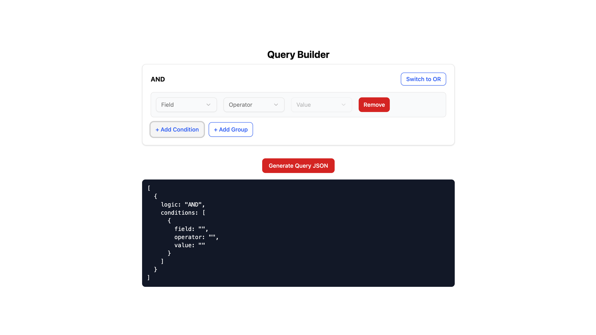

# Query Builder Component

A fully dynamic **Query Builder UI** built with **React** and **TypeScript**. This component enables users to construct complex queries using **AND/OR** logic, including support for nested condition groups.

---

## Live Demo

**Try it on Vercel:** [https://query-builder-rho.vercel.app](https://query-builder-rho.vercel.app)

---

## Screenshot



---

## Overview

This project aims to deliver a flexible Query Builder component featuring:
- Creation and management of multiple conditions.
- Each condition includes **Field**, **Operator**, and **Value** selectors.
- Grouping of conditions with **AND/OR** logic.
- Support for nested groups of conditions.

---

## Features

- Add, edit, and remove conditions dynamically
- Group conditions with **AND/OR** logic
- Nest condition groups as needed
- Toggle logic type for any group
- Real-time, formatted query output
- Output JSON matches assignment requirements
- Built with **React Functional Components** and **Hooks**
- Modular, reusable, and production-ready codebase
- Minimal UI using **Tailwind CSS** and **Shadcn UI**

---

## Tech Stack

| Library / Tool         | Purpose                        |
|------------------------|--------------------------------|
| **React + TypeScript** | UI and component logic         |
| **Tailwind CSS**       | Utility-first styling          |
| **Shadcn/UI**          | Composable UI components       |
| **Vite**               | Fast development bundler       |
| **ESLint + Prettier**  | Code quality and formatting    |

---

## Folder Structure

```
/QueryBuilder
├── public/                # Static assets
├── src/
│   ├── assets/            # Images and static resources
│   ├── components/        # Reusable React components
│   ├── hooks/             # Custom React hooks
│   ├── types/             # TypeScript type definitions
│   ├── utils/             # Utility functions
│   ├── App.tsx            # Main app entry
│   └── main.tsx           # Vite entry point
├── package.json
├── tailwind.config.js
├── tsconfig.json
└── README.md
```

---

## Quick Start

1. **Clone the repository**
  ```bash
  https://github.com/iamsuryakant/QueryBuilder.git
  
  cd QueryBuilder
  ```
2. **Install dependencies**
  ```bash
  npm install
  ```
3. **Run locally**
  ```bash
  npm run dev
  ```
4. **Open in your browser:**  
  [http://localhost:5173](http://localhost:5173)
